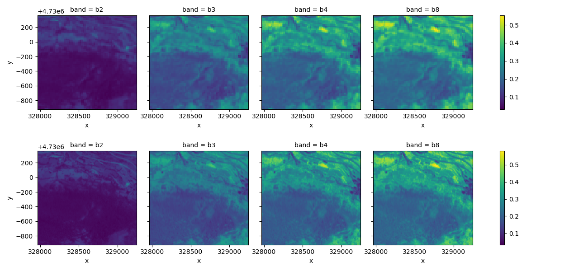

# sen2venus-pytorch-dataset
Unofficial dataloader for the [Sen2Venµs dataset](https://zenodo.org/record/6514159), baked at [CESBIO](https://www.cesbio.cnrs.fr/) by [Julien Michel, Juan Vinasco-Salinas, Jordi Inglada and Olivier Hagolle](https://doi.org/10.3390/data7070096).

## Overview

This package provides a simple way to download and use the [Sen2Venµs dataset](https://zenodo.org/record/6514159) within the pytorch and Xarray ecosystems.

```python
from sen2venus import Sen2VenusSite
import matplotlib.pyplot as plt

dataset = Sen2VenusSite(root='./', site_name='SUDOUE-4', load_geometry=True, subset='all')
input, target = dataset.getitem_xarray(0)
input.plot.imshow(col='band')
target.plot.imshow(col='band')
plt.show()
```


## Features

- [x] **Automatic download from zenodo**: The Zenodo URLs and hashes are included. From a region name ([see the list](https://zenodo.org/record/6514159)), the corresponding subset is downloaded and decompressed. 

- [x] **x2, x4 or multi-resolution dataset loading**: you can pick the `rgbnir` or the `rededge` subset to load the x2 or the x4 low (Sentinel-2) and high (Venus) resolution patches, or specify `all` to concatenate Sentinel-2 multi-resolution bands, as in [this paper](https://hal.science/hal-04218629).

- [x] **inspired from existing frameworks**: the Sen2Venus class is inspired from [the torchsr dataset definition style](https://github.com/Coloquinte/torchSR/tree/main/torchsr/datasets) and the torchvision download utility are used.

- [x] **automatically retrieve geospatial information**: includes method to convert the dataset samples to Xarray `DataArray`s

- [x] **compatible with [sr-pytorch-lightning](https://github.com/george-gca/sr-pytorch-lightning/tree/main)**: you can train your own SR model using a [fork of sr-pytorch-lightning](https://github.com/piclem/sr-pytorch-lightning).

## TODO / WIP

- [x] better integration of download within class instantiation - currently needs to be reinstantiated
- [x] multiple regions download
- [x] pypi publishing
- [ ] parallel downloads
- [x] integration with [sr-pytorch-lightning](https://github.com/george-gca/sr-pytorch-lightning/tree/main)

## Installation

You can install the package using `pip`:

```bash
git clone https://github.com/piclem/sen2venus-pytorch-dataset.git
cd sen2venus
pip install . 
```

(pypi publication to come later)

## Documentation (WIP)

For more detailed information on the available parameters, methods, and best practices, please refer to the documentation.

## Support and Issues (WIP)

If you encounter any issues, bugs, or have questions about the package, please feel free to open an issue on the GitHub repository. We appreciate your feedback!

## License

This package is released under the MIT License.
